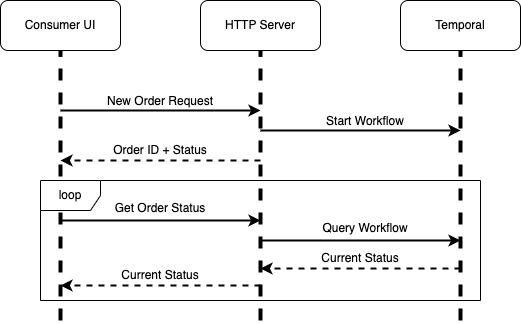

# GopherPizza

Temporal demo application, originally designed and written for GopherCon 2022 in Chicago.

There are three components to this app:

1. Temporal workflow, representing the process for ordering a pizza
1. Typescript, Node, Express service to intermediate between Temporal and the UI
1. UI, currently in Flutter

- [GopherPizza](#gopherpizza)
  * [Building and running](#building-and-running)
- [Checkpoint 1](#checkpoint-1)
  * [Intended Usage](#intended-usage)
  * [Notes](#notes)
- [Checkpoint 1a](#checkpoint-1a)
  * [Intended Usage](#intended-usage-1)
- [Checkpoint 2](#checkpoint-2)
  * [Intended Usage](#intended-usage-2)
- [Checkpoint 3](#checkpoint-3)
  * [Intended Usage](#intended-usage-3)
  * [Notes](#notes-1)
- [TODO](#todo)
  * [Repo Structure](#repo-structure)
  * [Temporal](#temporal)
  * [Frontend](#frontend)
  * [Backend/Admin UI](#backendadmin-ui)

## Building and running

This was developed with the following on macos:
* go v1.18.4
* node v16.16.0 and tsc v4.8.3
* flutter v3.3.2 and dart v2.18.1 on device: macos
* proto3 and libprotoc v3.20.1
* temporalite v1.17.3

To build and run:
1. `make proto`
1. `temporalite start --namespace default`
1. `cd api; npm run serve`
1. `cd temporal; go run worker/main.go`
1. `cd frontend; flutter run -d macos`

Alternatively, see the [`run_all.sh`](./run_all.sh) script.

# Checkpoint 1

Checkpoint 1 is a barebones, but complete, application. There is no fancy logic: the consumer UI (Flutter) sends an HTTP request for a new order, the HTTP server starts a Temporal workflow, and the UI polls for status until the workflow is finished.

Within the workflow, the three activities are stubs: each waits a random amount of time and, barring external factors, always succeeds.

The following diagram depicts that process at a high level:

## Intended Usage

Checkpoint 1 is intended to show resumability of workflows in the face of a single unreliable worker process. To do this:
1. Get everything up and running (see above)
2. Open Consumer UI, start a new order
3. Kill the worker at a reasonable place
4. Wait
5. Observe no change in either the Consumer or Temporal UIs
6. Start a new worker
7. In Temporal UI: Observe workflow resuming
8. In Consumer UI: Observe status updates

Things to observe and/or point out:
* In the Consumer UI, there appears to be nothing wrong.
* In the Temporal UI and the Worker's logs, the new Worker picks up with the last unsuccessful/unfinished activity.

## Notes
* Contrary to prior statements, there actually is a little bit of fancy logic here: Workflow Queries can only succeed when there is a Worker running and listening. Because of this, Order Status requests contain the last known status, allowing the HTTP server to catch a failed Workflow Query and return that last known status.
* An alternate demo of this is to show process-agnostic execution. That is, start two Workers instead of just one. After observing in the logs which one picked up the workflow, kill it. Then observe the other Worker picking up the work.
* To facilitate this demo, a few allowances are made:
    * Timeouts, random sleeps, and max intervals are unrealistically short.
    * Activities are only implied to be idempotent. No explicit actions are taken in order to ensure idempotency. (Although technically they **_are_** idempotent in the sense that they do nothing and have no side effects.)
    * Activity success is assumed, and therefore there are no compensation pathways.

# Checkpoint 1a

Checkpoint 1a adds some interactivity for passing developers. There's a bug in one of the activities causing it to fail with some inputs. Your mission, should you choose to accept it: Fix the bug.

The only difference between this checkpoint and the previous is the introduction of that bug.

## Intended Usage

This checkpoint is meant to show recovery not just from infrastructure-level failures, but also from developer mistakes.
1. Get everything up and running (see above)
2. Open Consumer UI, start a new order
3. Open Temporal UI, note the Activity failure
4. Open code, fix bug
5. Restart worker

Things to observe and/or point out:
* Like Checkpoint 1 above, workflow doesn't start from the beginning but from the failed Activity.

# Checkpoint 2

Checkpoint 2 has two major differences from Checkpoint 1:

* Infrastructure-layer reliability via Kubernetes-hosted workers
* Automated failure, in two variants:
    * The Workers will randomly panic-terminate themselves
    * Activities will randomly fail, with retryable errors and unlimited attempts

Consumer UI and HTTP server are unchanged.

## Intended Usage

Checkpoint 2 is essentially an automated version of Checkpoint 1. All workflows will always succeed (eventually), you just have to watch it happen:
1. Get everything up and running (see above)
2. Open Consumer UI, start a new order
3. Open Temporal UI, refresh periodically
4. Repeat as desired

Things to observe and/or point out:
* In the Temporal UI, observe the Workflow continuing to make progress
* Similar progress can be observed in the Consumer UI, with the status eventually converging on Done.

# Checkpoint 3

Checkpoint 3 takes the automation one step further and creates a continuous stream of new orders from the Consumer UI. To accommodate this, here's what's been changed or added:
* Consumer UI
    * New page for streaming orders, including a configuration for various rates
    * Sub view containing various metrics
* HTTP Server
    * Added batch status request
* Temporal Workflows
    * More Worker nodes and a slightly longer Worker lifespan

## Intended Usage

Checkpoint 3 is intended to demonstrate full-application reliability in the face of numerous requests and an unreliable underlying infrastructure.
1. Get everything up and running (see above)
2. Open Consumer UI, select streaming orders and accept default settings
3. [Optionally] Open stats view

Things to observe and/or point out:
* In the Temporal UI, we register the existence of *lots* of workers as they come and go.
* In a single Workflow, the Worker of record changes between successful activity executions. 
* The number of failed Workflows/Orders is zero

## Notes

* The Consumer UI has no notion of "session" or "user." If you restart the app, you get a clean batch of orders. (Meanwhile, the Workflows from the previous instance will happily continue running to completion.)

# TODO

## Repo Structure

Overall goal: have multiple checkpoints in this demo that relate to different use-cases or learning journeys.

Possible options:
- [ ] Plain, self-run everything. Small handful of workers.
- [ ] Kubernetes-hosted workers. Otherwise happy state.
- [ ] Introduce chaos. Workers are randomly killed.
- [ ] Multiple task queues. One activity has special requirements and so we run on its own task queue. Different failure rates for each one. 
- [ ] Dependant workflows / re-architecture

## Temporal
- [ ] Add interesting business logic
- [ ] Add chaos
- [ ] Add artificially created load
- [ ] Add pathway for "realtime" contribution (i.e., can conference attendees add or modify the workflow live?)
- [ ] Split out different activities into different task queues, potentially to make chaos more interesting.
- [ ] Host workers with docker/k8s

## Frontend
- [ ] Allow users to submit a custom order and easily keep track of it
- [ ] Animate or otherwise give life to the randomly created gophers
- [ ]  ... ?

## Backend/Admin UI
- [ ] Create something (is this just the Temporal UI that we refresh periodically?) where we can monitor things like how many pizza orders are current out, successfully delivered, etc.

